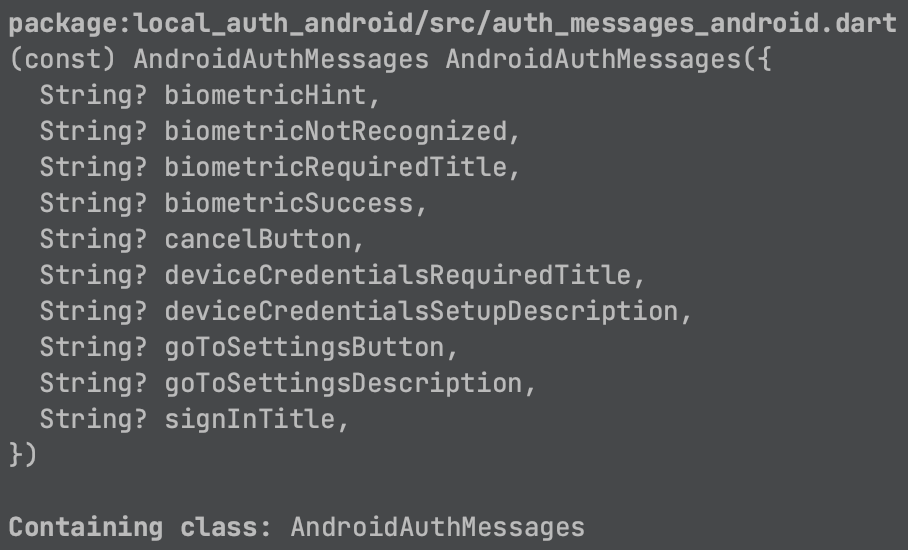
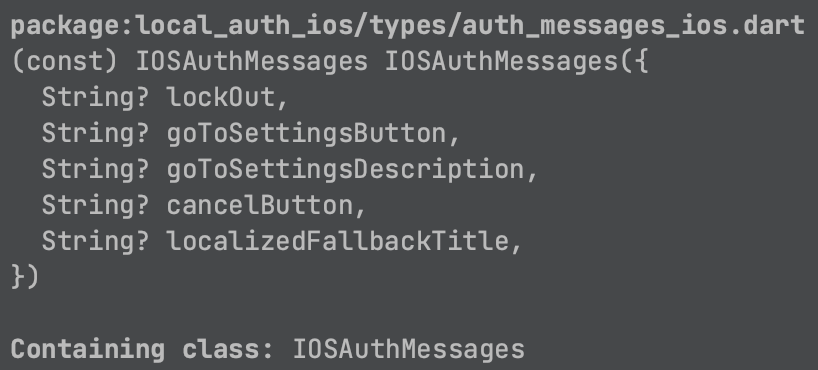

## 1. Research: Local Auth Package Flutter

- Keywords:
    - local auth package flutter
    - local auth flutter example
    - flutter local auth face id
    - flutter local auth invisible
    - flutter biometric authentication
    - flutter fingerprint attendance
    - flutter local auth passcode
    - flutter biometric authentication example
    - flutter fingerprint
    - flutter pin authentication
    - face id authentication in flutter
    - flutter biometric authentication github
    - local auth flutter
    - flutter local auth face id
- Video Title: Local Auth Package in Flutter | Flutter Local Auth with Biometric, Fingerprint,
  FaceId and Pin authentication

## 2. Research: Competitors

**Flutter Videos/Articles**

- 34K: https://www.youtube.com/watch?v=qTuVurGvdbM
- 6.6K: https://www.youtube.com/watch?v=r78T0XpFB7s
- 28K: https://www.youtube.com/watch?v=w0-UB7rx8TA
- 883: https://www.youtube.com/watch?v=j8XZaG_NKBE
- 627: https://www.youtube.com/watch?v=s__kK3v71GU
- 3.5K: https://www.youtube.com/watch?v=4bHrdhXmPVI
- https://pub.dev/packages/local_auth
- https://pub.dev/documentation/local_auth/latest/
- https://blog.logrocket.com/implementing-face-recognition-authentication-flutter/
- https://medium.com/globant/touch-id-and-face-id-authentication-using-flutter-382b85509548
- https://blog.codemagic.io/flutter-local-authentication-using-biometrics/
- https://protocoderspoint.com/flutter-face-recognition-and-authentication-implementation/
- https://dev.to/mrcflorian/flutter-local-authentication-using-biometrics-face-id-touch-id-fingerprint-27ol
- https://www.fluttercampus.com/guide/122/how-to-authenticate-with-biometrics-pi-and-pattern-in-flutter-app/
- https://medium.flutterdevs.com/passcode-local-authentication-in-flutter-1838e05544fb

**Android/Swift/React Videos**

- 11K: https://youtu.be/iqr_ySZ5Dus
- 6.5K: https://youtu.be/pDul7qeXwUk
- 6.6K: https://youtu.be/r78T0XpFB7s
- 1.6K: https://youtu.be/3LHxGg_2DH8
- 1.1K: https://youtu.be/R7Dw-ZyOpHQ
- 3.6K: https://youtu.be/8MLdq9kotII
- 18K: https://youtu.be/SHmDljfu2lk
- 5.5K: https://youtu.be/AKqr5iU9sU8
- 4.4K: https://youtu.be/aUf3yMW7fiM
- 14K: https://youtu.be/0HIOq9hsIKs
- https://www.npmjs.com/package/react-native-biometrics
- https://betterprogramming.pub/touch-id-and-face-id-authentication-in-your-react-native-app-1e455c1fe080
- https://medium.com/swlh/how-to-use-face-id-with-react-native-or-expo-134231a25fe4
- https://developer.android.com/training/sign-in/biometric-auth
- https://www.axon.dev/blog/what-is-android-biometric-full-guide
- https://gaikwadchetan93.medium.com/android-biometricmanager-class-biometric-authentication-solution-for-android-d26026e1fc60
- https://www.kodeco.com/18782293-android-biometric-api-getting-started
- https://developer.apple.com/documentation/localauthentication/logging_a_user_into_your_app_with_face_id_or_touch_id
- https://www.hackingwithswift.com/read/28/4/touch-to-activate-touch-id-face-id-and-localauthentication
- https://www.advancedswift.com/face-id-touch-id-swift/

**Great Features**

- It allows local authentication for Android and iOS devices via fingerprint, touch ID, face ID,
  passcode, pin, or pattern.
- Find more features at [pub.dev](https://pub.dev/packages/local_auth).

**Problems from Videos**

- Question: Face id is not open in android devices they open only fingerprint. How to open face id
  in android devices?
  <br/> Answer: By default the library should be able to detect both face and fingerprint but I
  guess its prioritizing fingerprint.
- Question: Can I use this for, let's say, digitally sign documents?
  <br/> Answer: You could learn more about security of Local Auth here:

1. Security of Local Auth Tutorial & When Not to use
   it: [http://www.youtube.com/watch?v=4-P_Su9O5NM&t=9m26s](http://www.youtube.com/watch?v=4-P_Su9O5NM&t=9m26s)
2. Local Auth Security
   Article: [https://medium.com/csg-govtech/how-you-should-secure-your-androids-app-biometric-authentication-10d9231215e4](https://medium.com/csg-govtech/how-you-should-secure-your-androids-app-biometric-authentication-10d9231215e4)

- Question: Hi, I want my app to check fingerprint authentication as soon as it loads without using
  onPressed function. How?
- Answer: Simply execute it somewhere else such as within the initState method. Learn more about the
  Flutter Lifecycle [here](https://www.youtube.com/watch?v=FL_U8ORv-2Q):

**Problems from Flutter Stackoverflow**

- https://stackoverflow.com/questions/67546548/encryption-in-java-and-decryption-in-flutter-aes-256
- https://stackoverflow.com/questions/67722252/unable-to-authenticate-using-flutter-local-auth-plugin
- https://stackoverflow.com/questions/73713418/is-it-not-valid-now-the-authenticatewithbiometrics-in-local-auth-plugin
- https://stackoverflow.com/questions/67121556/flutter-local-auth-required-security-features-not-enabled
- https://stackoverflow.com/questions/68220888/i-flutter-805-platformexceptionno-fragment-activity-local-auth-plugin-requ
- https://stackoverflow.com/questions/74282427/local-auth-useerrordialogs-is-not-working-for-second-time
- https://stackoverflow.com/questions/72989480/authenticate-with-biometrics-not-defined-flutter
- https://stackoverflow.com/questions/75206089/local-auth-ios-flutter
- https://stackoverflow.com/questions/62210423/flutter-local-auth-doesnt-work-on-android-28
- https://stackoverflow.com/questions/66499220/local-authentication-problem-in-release-apk-flutter
- https://stackoverflow.com/questions/59441558/flutter-local-auth-0-6-1-platformexceptionerror-you-need-to-use-a-theme
- https://stackoverflow.com/questions/64045554/flutter-local-auth-issues-on-android-certain-devices
- https://stackoverflow.com/questions/69970290/flutter-local-auth-can-be-bypassed-by-pressing-the-back-button

## 3. Video Structure

**Main Points / Purpose Of Lesson**

1. In this video, you will learn how to authenticated android and iOS devices via fingerprint, touch
   ID, face ID, passcode, pin, or pattern.
2. Main points
    - Check availability of all types of authentications
    - Authenticate using available authentication methods
    - Keep in mind that many android and iOS devices support only face id and some support
      fingerprint. For android visit [this](https://pub.dev/packages/local_auth#compatibility) and
      for iOS
      visit [this](https://en.wikipedia.org/wiki/Touch_ID#:~:text=Apple%20retained%20Touch%20ID%20on,have%20adopted%20Face%20ID%20recognition)
      .
3. Its very useful for security, convenience, customizability and ease of use.

**The Structured Main Content**

1. Run `dart pub add local_auth` in terminal to add local_auth package in your project's
   pubspec.yaml file.
2. Output of this project is following:

   

3. For this package:
    - Steps for Android integration
      are [here](https://pub.dev/packages/local_auth#android-integration).

      Check compatibility of android [here](https://pub.dev/packages/local_auth#compatibility).

    - Steps for iOS integration are [here](https://pub.dev/packages/local_auth#ios-integration).

      Check compatibility of
      iOS [here](https://en.wikipedia.org/wiki/Touch_ID#:~:text=Apple%20retained%20Touch%20ID%20on,have%20adopted%20Face%20ID%20recognition)
      .
4. `my_app.dart` contains theming properties of app. It is being called by `runApp` in `main.dart`.
   Its `home` property is calling HomePage from `home_page.dart`.
5. `local_auth_api.dart` file contains `isDeviceSupported()`, `canCheckBiometrics()`
   , `getBiometrics()`, and `authenticate()` methods in it.

   All these methods are called in `home_page.dart` to perform their relevant functionalities.

   Initialize `LocalAuthentication()` using local_auth package
   import `static final auth = LocalAuthentication();`. Use this `auth` variable for all methods.

```dart
import 'package:flutter/material.dart';
import 'package:flutter/services.dart';
import 'package:local_auth/local_auth.dart';

import 'package:local_auth_android/local_auth_android.dart';
import 'package:local_auth_ios/local_auth_ios.dart';

class LocalAuthApi {
  static final auth = LocalAuthentication();

  static Future<bool> isDeviceSupported() async {
    try {
      return await auth.isDeviceSupported();
    } on PlatformException catch (error) {
      debugPrint(error.toString());
      return false;
    }
  }

  static Future<bool> canCheckBiometrics() async {
    try {
      return await auth.canCheckBiometrics;
    } on PlatformException catch (error) {
      debugPrint(error.toString());
      return false;
    }
  }

  Future<List<BiometricType>> getBiometrics() async {
    try {
      return await auth.getAvailableBiometrics();
    } on PlatformException catch (error) {
      debugPrint(error.toString());
      return <BiometricType>[];
    }
  }

  static Future<bool> authenticate() async {
    final isAvailable = await isDeviceSupported() && await canCheckBiometrics();
    if (!isAvailable) return false;
    try {
      return await auth.authenticate(
        localizedReason: 'Scan fingerprint to authenticate',
        authMessages: const [
          AndroidAuthMessages(
            signInTitle: 'Scan fingerprint to authenticate',
            cancelButton: 'No thanks',
            biometricSuccess: 'Success',
          ),
          IOSAuthMessages(
            localizedFallbackTitle: 'Scan finger to authenticate',
            cancelButton: 'No thanks',
          ),
        ],
        options: const AuthenticationOptions(
          useErrorDialogs: true,
          stickyAuth: true,
          biometricOnly: false,
          sensitiveTransaction: true,
        ),
      );
    } on PlatformException catch (error) {
      debugPrint(error.toString());
      return false;
    }
  }
}

```

- All these methods are in try-catch block like:

```dart 
    try {
  ...
    } on PlatformException catch (error) {
  ...
    }
```

- `isDeviceSupported()` method checks if the device is supported or not
  using `await auth.isDeviceSupported()`.

  Returns true if device is capable of checking biometrics or is able to fail over to device
  credentials.
- `canCheckBiometrics()` method uses `await auth.canCheckBiometrics`.

  It returns true if device is capable of checking biometrics
- `getBiometrics()` method return List<BiometricType>
  using `return await auth.getAvailableBiometrics()`.
- `authenticate()` method is main method which is used for authentication in android and iOS.
    - It returns Future<bool>.
    - Following code is used to check whether the device is supported and can check available
      biometrics.

```dart 
    final isAvailable = await isDeviceSupported() && await canCheckBiometrics();
    if (!isAvailable) return false;
```

- If isAvailable is false. It will return false and will not authenticate.

- Otherwise it will use `return await auth.authenticate()` to authenticates the user with biometrics
  available on the device while also allowing the user to use device authentication - pin, pattern,
  passcode.
- Returns true if the user successfully authenticated, false otherwise.
- `authenticate()` has three arguments:
    - `localizedReason` accepts string. It is required and other parameters are
      optional. `localizedReason` is the message to show to user while asking them for
      authentication. This is typically along the lines of: '
      Authenticate to access MyApp.'. This must not be empty.
    - `authMessages` provide authMessages if you want to customize messages in the dialogs on
      different platforms android, iOS and windows.

      

      

    - `options` accepts AuthenticationOptions() widget. AuthenticationOptions() widget has following
      four arguments:
        - `useErrorDialogs` show error dialogs encountered while authenticating.
        - `stickyAuth` parameter allows you to control whether the authentication state remains
          active even after the app is closed and reopened.
            - If stickyAuth is set to true, the authentication state will persist, and the user will
              not need to re-authenticate when reopening the app.
            - If stickyAuth is set to false, the authentication state will not persist, and the user
              will need to authenticate again after reopening the app.
        - `sensitiveTransaction` used whether platform specific precautions are enabled. For
          instance, on face unlock, Android opens a confirmation dialog after the face is recognized
          to make sure the user meant to unlock their device.
        - `biometricOnly` prevent authentications from using non-biometric local authentication such
          as pin, passcode, or pattern.

6`home_page.dart` contains two ElevatedButton with icons and two texts in a column.

Initialize the following:

```dart

bool isDeviceSupported = false;
bool canCheckBiometrics = false;
List<BiometricType> availableBiometrics = [];
```

- First ElevatedButton.icon code:

```dart 
              ElevatedButton.icon(
                icon: const Icon(Icons.event_available),
                onPressed: () async {
                  final isAvailable = await LocalAuthApi.isDeviceSupported();
                  final canCheckBiometric =
                      await LocalAuthApi.canCheckBiometrics();
                  setState(() {
                    isDeviceSupported = isAvailable;
                    canCheckBiometrics = canCheckBiometric;
                  });
                  final biometrics = await LocalAuthApi().getBiometrics();
                  debugPrint('biometrics: $biometrics');
                  final hasStrong = biometrics.contains(BiometricType.strong);
                  debugPrint('hasStrong: $hasStrong');
                  final hasWeak = biometrics.contains(BiometricType.weak);
                  debugPrint('hasWeak: $hasWeak');
                  final hasFace = biometrics.contains(BiometricType.face);
                  debugPrint('hasFace: $hasFace');
                  final hasFingerprint =
                      biometrics.contains(BiometricType.fingerprint);
                  debugPrint('hasFingerprint: $hasFingerprint');
                  final hasIris = biometrics.contains(BiometricType.iris);
                  debugPrint('hasIris: $hasIris');

                  if (!mounted) return;
                  showDialog(
                    context: context,
                    builder: (context) => AlertDialog(
                      title: const Text('Availability'),
                      content: Column(
                        mainAxisAlignment: MainAxisAlignment.start,
                        mainAxisSize: MainAxisSize.min,
                        children: [
                          listTile('Biometrics', isAvailable),
                          listTile('Strong', hasStrong),
                          listTile('Weak', hasWeak),
                        ],
                      ),
                    ),
                  );
                },
                label: const Text('Check Availability'),
              ),
```

LocalAuthApi.isDeviceSupported() and LocalAuthApi.canCheckBiometrics() update the boolean variables
isDeviceSupported and canCheckBiometrics using setState((){}) which are used in two text widget.

- Second ElevatedButton.icon code:

```dart 
              ElevatedButton.icon(
                icon: const Icon(Icons.lock_open),
                onPressed: () async {
                  final isAuthenticated = await LocalAuthApi.authenticate();
                  if (isAuthenticated) {
                    if (!mounted) return;
                    Navigator.push(
                      context,
                      MaterialPageRoute(
                        builder: (context) => const AuthenticatedPage(),
                      ),
                    );
                  }
                },
                label: const Text('Authenticate'),
              ),
```

This button authenticates the user using `await LocalAuthApi.authenticate()`.

If it return true then go to `AuthenticatePage` in `authenticated_page.dart`.

If it return false then it shows error device is not supported.